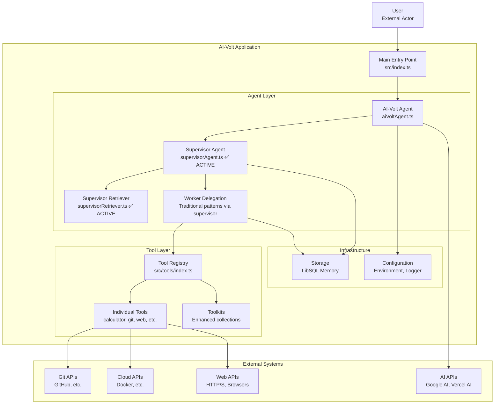

# AI-Volt Agent Instructions

This document provides instructions for working with the AI-Volt agent system based on verified codebase analysis.

## Project Overview

AI-Volt is a multi-agent system built with VoltAgent framework that operates on a supervisor/worker architecture for task coordination and delegation.

## Verified Technology Stack

### Core Framework
- **VoltAgent Core** (`@voltagent/core` v0.1.31): Open-source TypeScript framework for building AI agents
  - TypeScript-native design philosophy: "Powerful defaults, infinite customization"
  - Modular package system - only use what you need (@voltagent/voice, @voltagent/supabase, etc.)
  - Real tool integration for messy, real-world business systems
  - State management inspired by modern frontend development (React-like patterns)
  - Provider-agnostic design - easy switching between OpenAI, Anthropic, Google, etc.
  - VoltOps LLM Observability Platform for debugging and monitoring (like React DevTools for AI agents)
  - Supervisor/worker coordination patterns for complex workflows
- **Vercel AI SDK** (`ai` v4.3.16): AI model integration with provider abstraction
- **Google AI** (`@ai-sdk/google` v1.2.19): Primary LLM provider integration
- **TypeScript** (v5.8.3): Development language with strict typing

### AI Models
- **Primary Model**: `gemini-2.5flash` (updated from deprecated 1.5)
- **Provider**: Google AI via Vercel AI SDK

### Storage & Memory
- **LibSQL**: Agent memory storage via `@voltagent/core`
- **Local SQLite**: Default storage in `.voltagent/` directory per agent type

### Key Dependencies (Verified from package.json)
- **Zod** (v3.25.57): Schema validation and type safety
- **Playwright** (v1.52.0): Browser automation and web scraping
- **Isomorphic Git** (v1.30.2): Git operations with cross-platform compatibility
- **Octokit** (v22.0.0): GitHub API client for repository management
- **Axios** (v1.9.0): HTTP requests and API communication
- **OpenTelemetry**: Distributed tracing and monitoring
- **QuickLRU** (v7.0.1): Efficient LRU caching for agent memory
- **Supabase/Pinecone**: Vector storage capabilities (dependencies present)
- **Langchain** (v0.3.27): LLM framework integration and RAG support

### VoltAgent Ecosystem Extensions
- **@voltagent/voice**: Voice interaction capabilities for conversational agents
- **@voltagent/vercel-ai**: Enhanced Vercel AI SDK integration
- **@voltagent/supabase**: Supabase storage integration for agents
- **@voltagent/cli**: Command-line tools for agent development
- **VoltOps Platform**: Visual monitoring and debugging tools

## Architecture

Based on verified codebase analysis (ACTUAL USAGE):

```
AI-Volt System
├── AI-Volt Agent (src/agents/aiVoltAgent.ts)
├── Supervisor Agent (src/agents/supervisorAgent.ts) ✅ ACTIVE
├── Supervisor Retriever (src/agents/supervisorRetriever.ts) ✅ ACTIVE
└── Worker Agents: Traditional delegation pattern via supervisorAgent
    ├── SystemInfoAgent (via delegation)
    ├── FileOpsAgent (via delegation)
    ├── GitAgent (via delegation) 
    ├── BrowserAgent (via delegation)
    ├── CodingAgent (via delegation)
    ├── DebugAgent (via delegation)
    ├── ResearchAgent (via delegation)
    ├── KnowledgeBaseAgent (via delegation)
    ├── DataAgent (via delegation)
    └── CloudAgent (via delegation)
```

**Note**: The `subAgents.ts` file exists but is NOT being used in the current implementation. The supervisor uses traditional delegation patterns rather than separate agent files.

## Required Environment Variables

Based on `.env.example`:

```bash
GOOGLE_GENERATIVE_AI_API_KEY=your_google_ai_api_key_here
GITHUB_TOKEN=your_github_token_here  
PK=voltagent_public_key
SK=voltagent_secret_key
NODE_ENV=development
LOG_LEVEL=info
PORT=3141
```

## Development Patterns

### Code Quality Requirements
- Use TypeScript with strict typing
- Implement Zod schemas for validation
- Include TSDoc comments on exports
- Use async/await consistently
- Proper error handling with try/catch
- Symbol-based context keys for type safety

### Agent Development
- Extend VoltAgent base classes (`Agent`, `BaseRetriever`)
- Use `LibSQLStorage` for agent memory (isolated per agent type)
- Implement comprehensive hooks for monitoring
- Follow supervisor/worker delegation pattern
- Use `generateId()` from `ai` package for ID generation
- **Critical**: Hook arguments must use typed parameters, not direct destructuring
- **Required**: All async operations need try/catch error handling
- **Mandatory**: Tool outputs must be strings for proper VoltAgent integration

## Tool Categories (Verified from src/tools/index.ts)

### Available Tool Types
- **Calculator**: Mathematical operations and statistics
- **DateTime**: Date/time utilities  
- **System**: System information and environment analysis
- **Knowledge Base**: Document ingestion, querying, and summarization
- **Data Tools**: File operations, CSV analysis, compression
- **Web Browser**: Scraping, content extraction, Playwright automation
- **Git**: Version control operations (standard and enhanced)
- **GitHub**: Repository management via API
- **Coding**: File operations and sandboxed code execution
- **Debug**: Code analysis, linting, security checks
- **Cloud**: Docker container management and deployment
- **Prompt Management**: Dynamic prompt handling

### Tool Organization
- Individual tools exported from specific modules
- Toolkits grouping related functionality
- `allTools` array containing all individual tools
- `allToolkits` array containing grouped functionality

## VoltAgent Framework Deep Dive

### What is VoltAgent?
VoltAgent is an open-source TypeScript framework for building and orchestrating AI agents. It provides a comprehensive ecosystem of modular building blocks that allows developers to create sophisticated AI applications without the limitations of no-code builders or the complexity of starting from scratch.

### Core VoltAgent Capabilities
1. **Agent Core**: Fundamental capabilities for defining agents with roles, tools, and memory
2. **Multi-Agent Systems**: Complex workflow coordination using Supervisor Agents
3. **Tool Usage & Lifecycle**: Type-safe tools with lifecycle hooks and cancellation support
4. **Flexible LLM Support**: Works with OpenAI, Anthropic, Google, and other providers
5. **Memory Management**: Context retention across interactions using various memory providers
6. **Observability & Debugging**: Visual monitoring via VoltAgent Console
7. **Voice Interaction**: Voice-enabled agents using `@voltagent/voice`
8. **Data Retrieval & RAG**: Specialized retriever agents for information fetching
9. **MCP Support**: Connects to external tool servers via Model Context Protocol
10. **Prompt Engineering Tools**: Utilities for crafting and managing prompts

### VoltAgent Design Philosophy & Benefits
- **"Powerful defaults, infinite customization"**: Ready solutions for most use cases with unlimited flexibility for special needs
- **TypeScript-First**: Type safety prevents runtime errors in complex agent systems - "type safety really saves lives"
- **Modular Architecture**: Zero bloat - only import what you need (`@voltagent/core`, `@voltagent/voice`, etc.)
- **Production-Ready**: Built for real business systems, not just prototypes or demos
- **Developer Experience**: Fast from idea to running code with `create-voltagent-app` starter
- **Observability**: VoltOps platform provides visibility into agent behavior for debugging
- **Framework Flexibility**: Easy provider switching - change a config value, not rewrite your app

### VoltAgent vs Alternatives
- **Compared to LangChain/AutoGen**: Less Python-centric, more TypeScript-native
- **Compared to No-Code Builders**: More flexible and customizable for complex requirements  
- **Compared to DIY/Raw APIs**: Structured components without sacrificing control
- **Best for**: JavaScript/TypeScript developers building production applications that need real system integration

## VoltAgent Patterns

### Context Management
```typescript
// Symbol-based context keys
const CONTEXT_KEYS = {
  SESSION_ID: Symbol("sessionId"),
  TASK_ID: Symbol("taskId"),
} as const;

// Setting context
context.userContext.set(CONTEXT_KEYS.SESSION_ID, sessionId);

// Getting context
const sessionId = context.userContext.get(CONTEXT_KEYS.SESSION_ID);
```

### Hook Implementation
```typescript
// ✅ CORRECT - Use typed arguments (learned from production debugging)
const hooks = createHooks({
  onStart: async (args: OnStartHookArgs) => {
    const { agent, context } = args; // Destructure from args object
    const sessionId = `session-${generateId()}`;
    context.userContext.set(CONTEXT_KEYS.SESSION_ID, sessionId);
    // Initialize session data
  },
  onEnd: async (args: OnEndHookArgs) => {
    const { agent, output, error, context } = args;
    const sessionId = context.userContext.get(CONTEXT_KEYS.SESSION_ID);
    // Cleanup and logging with context correlation
  },
});

// ❌ WRONG - Direct parameter destructuring (causes hook issues)
// onStart: async ({ agent, context }: OnStartHookArgs) => { ... }
```

### Memory Storage
```typescript
// ✅ CORRECT - Isolated storage per agent type (prevents conflicts)
const memory = new LibSQLStorage({
  url: `file:./.voltagent/${agentType}-memory.db`, // Agent-specific file
  tablePrefix: `${agentType}_memory`, // Unique table prefix
  storageLimit: 200,
  debug: env.NODE_ENV === "development",
});

// ⚠️ Context key management - NEVER validate symbols as strings
const CONTEXT_KEYS = {
  SESSION_ID: Symbol("sessionId"), // Use symbols for type safety
  TASK_ID: Symbol("taskId"),
  OPERATION_ID: Symbol("operationId"),
} as const;
```

## Verified Implementation Details

### Session Management
- Session IDs generated with `generateId()` from AI SDK
- **CRITICAL**: No validation of symbol-based context keys (causes "Invalid session ID" errors)
- Proper context correlation across agent operations
- Use unique symbols for each context type to avoid conflicts

### Error Handling
- Comprehensive try/catch blocks for async operations
- Detailed logging with context correlation
- Proper error propagation through agent hierarchy
- **Mandatory**: Every `await` call must be wrapped in try/catch

### Tool Integration
- Tools categorized by functionality
- Both individual tools and grouped toolkits available
- Proper Zod schema validation for tool parameters
- **Required**: All tool outputs must be strings (use `JSON.stringify()` for objects)

### VoltAgent Compliance
- Hook argument patterns must follow exact VoltAgent specifications
- BaseRetriever implementations require specific method signatures
- LibSQL storage must be isolated per agent type
- Context correlation essential for multi-agent operations

## Notes Section

### Verified Working Features
- Multi-agent coordination via VoltAgent
- Google AI integration with Gemini 2.0 Flash
- LibSQL storage for conversation persistence
- Comprehensive logging and tracing
- Tool-based task execution
- GitHub integration for repository operations
- Playwright browser automation
- Git operations (standard and enhanced)

### Architecture Certainties
- Supervisor/worker pattern implemented
- Context-based agent communication
- Hook-based lifecycle management
- Memory isolation per agent type
- Symbol-based type-safe context keys

### Production-Tested Patterns
- **Session ID Management**: Never validate symbol context keys as strings
- **Hook Implementation**: Use typed arguments with proper destructuring  
- **Error Handling**: Comprehensive try/catch for all async operations
- **Tool Output**: String-only outputs for VoltAgent compatibility
- **Context Correlation**: Track operations across agent boundaries
- **Memory Isolation**: Agent-specific LibSQL storage prevents conflicts
- **Supervisor Delegation**: Use traditional delegation patterns instead of separate agent files

### Dependencies Present But Usage Unclear
- Supabase client configured but integration patterns not documented
- Pinecone vector database available but usage not verified
- Langchain integration present but extent unknown
- Voice capabilities (`@voltagent/voice`) available
- Multiple VoltAgent extensions available

## Critical Lessons from Production Issues

### Session ID Validation Anti-Pattern
**Problem**: The "Invalid session ID" SETUP_ERROR was caused by attempting to validate symbol-based context keys as strings.

**Root Cause**: A `validateContextKey` function that tried to convert symbols to strings for validation:
```typescript
// ❌ NEVER DO THIS - Causes session ID errors
function validateContextKey(key: symbol): string {
  return key.toString(); // Breaks symbol-based context management
}
```

**Solution**: Symbol-based context keys should never be validated as strings. Remove validation entirely:
```typescript
// ✅ CORRECT - Direct symbol usage without validation
context.userContext.set(CONTEXT_KEYS.SESSION_ID, sessionId);
const sessionId = context.userContext.get(CONTEXT_KEYS.SESSION_ID);
```

### VoltAgent Hook Patterns That Work
**Critical**: Hook argument destructuring must follow exact VoltAgent patterns:

```typescript
// ✅ CORRECT - Use typed arguments
const hooks = createHooks({
  onStart: async (args: OnStartHookArgs) => {
    const { agent, context } = args; // Destructure from args
    // Initialize session data
  },
  onEnd: async (args: OnEndHookArgs) => {
    const { agent, output, error, context } = args;
    // Cleanup and logging
  },
});

// ❌ WRONG - Direct destructuring in parameters
onStart: async ({ agent, context }: OnStartHookArgs) => {
  // This pattern can cause issues with VoltAgent
}
```

### Tool Output Requirements
**Mandatory**: All tools must return string outputs for proper VoltAgent integration:
```typescript
// ✅ CORRECT
return JSON.stringify(result);

// ❌ WRONG - Will cause integration issues  
return result; // Object/array without stringification
```

### Context Correlation Best Practices
**Pattern**: Always correlate context across agent operations:
```typescript
// Store operation correlation data
context.userContext.set(CONTEXT_KEYS.OPERATION_ID, context.operationId);
context.userContext.set(CONTEXT_KEYS.SESSION_ID, sessionId);
context.userContext.set(CONTEXT_KEYS.START_TIME, Date.now());

// Use in logging for traceability
logger.info("Operation completed", {
  sessionId: context.userContext.get(CONTEXT_KEYS.SESSION_ID),
  operationId: context.userContext.get(CONTEXT_KEYS.OPERATION_ID),
  duration: Date.now() - startTime,
});
```

### Memory Storage Isolation
**Pattern**: Each agent type should have isolated storage:
```typescript
// ✅ CORRECT - Agent-specific storage
const memory = new LibSQLStorage({
  url: `file:./.voltagent/${agentType}-memory.db`,
  tablePrefix: `${agentType}_memory`,
  storageLimit: 200,
  debug: env.NODE_ENV === "development",
});
```

### Error Handling Patterns
**Mandatory**: Every async operation must have comprehensive error handling:
```typescript
// ✅ CORRECT
try {
  const result = await someOperation();
  logger.info("Operation succeeded", { sessionId, result: result.slice(0, 100) });
  return result;
} catch (error: any) {
  logger.error("Operation failed", { 
    sessionId, 
    operationId: context.operationId,
    error: error.message,
    stack: error.stack 
  });
  throw error;
}
```

### Retriever Implementation Requirements
**Critical**: BaseRetriever implementations must follow exact patterns:
```typescript
// ✅ CORRECT - Method signature must match exactly
async retrieve(options: RetrieverOptions): Promise<string[]> {
  const query = typeof options.input === "string" 
    ? options.input 
    : (options.input[options.input.length - 1]?.content as string);
  
  // Store reference for context correlation
  this.userContext.set(CONTEXT_KEYS.LAST_QUERY, query);
  
  // Implementation with proper error handling
  try {
    const results = await this.searchImplementation(query);
    return results.map(r => JSON.stringify(r));
  } catch (error: any) {
    this.logger.error("Retrieval failed", { query, error: error.message });
    return [];
  }
}
```

## Common Anti-Patterns to Avoid

1. **Symbol Validation**: Never convert symbols to strings for validation
2. **Direct Hook Destructuring**: Use typed arguments instead of parameter destructuring
3. **Missing Error Handling**: Every async operation needs try/catch
4. **Non-String Tool Outputs**: All tools must return strings
5. **Context Key Conflicts**: Use unique symbols for each context type
6. **Memory Sharing**: Each agent should have isolated storage
7. **Missing Context Correlation**: Always track operations across agent boundaries

## Package Management

**Standard**: All operations use `npm` per project convention documented in CHANGELOG v0.0.8.

## Diagram Representation

